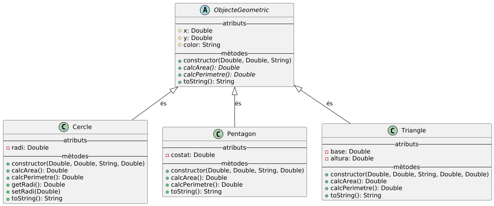

# Intro
Projecte de demostració d'ús de **Programació Orientada a Objectes** per **MP03**.

# Llenguatge
Kotlin desktop

# IDE
IntelliJ IDEA 2024.3.2 (Community Edition)

# Diagrama de Classes UML

# Contingut
- Classes i mètodes **abstractes**
- **Herència**
- Diferents **modificadors d'accés** per gestionar l'encapsulació
- **Poliformisme**
- **Documentació dokka**
